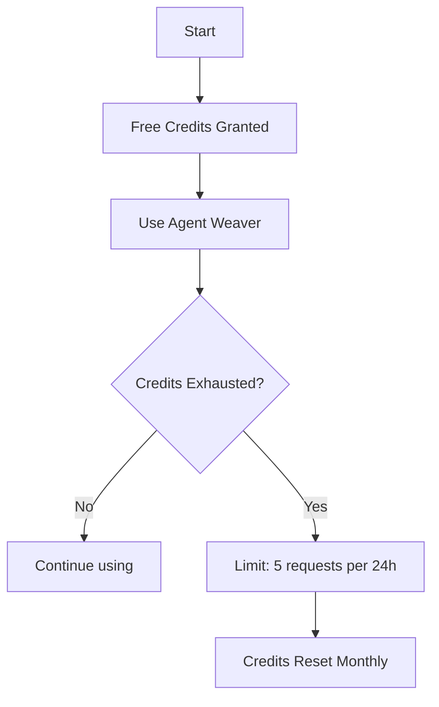

# Navigation

:::tip TL;DR
Start with or **Quickstart** if you want to build an agent right now.
:::

| Section           | Read this when you need                 |
| ----------------- | --------------------------------------- |
| **Agent Studio**  | Building workflows in the visual editor |
| **Agent Weaver**  | Letting AI draft an agent for you       |
| **Agent Runtime** | Running agents locally or on-prem       |
| **Deployments**   | Publishing an agent to the world        |
| **Collaboration** | Working in teams, sharing secrets       |
| **Templates**     | Pre-made agents you can remix           |

Links on every page will bounce you to the right topic, so feel free to skim.

> **All SmythOS plans (free & paid)** include free credits to use tools in the app, including Agent Weaver.  
> **After exhausting credits:** users are limited to 5 requests per 24 hours.  
> **Credit restoration:** credits are automatically restored at the beginning of each month.

<iframe
	width="786"
	height="442"
	src="https://www.youtube.com/embed/V0ft3GrLtjY"
	title="SmythOS - Lead Enrichment Agent"
	frameborder="0"
	allow="accelerometer; autoplay; clipboard-write; encrypted-media; gyroscope; picture-in-picture; web-share"
	referrerpolicy="strict-origin-when-cross-origin"
	allowfullscreen
></iframe>

## Handling Youtube component 

<YouTube videoId="ui9_W-JXmH8" title="SmythOS - Content Extractor" />

